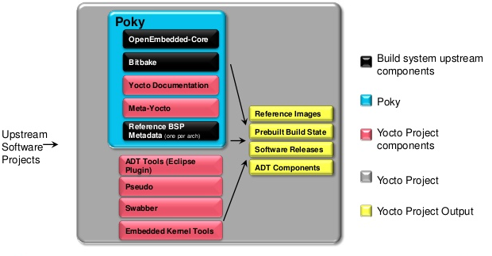

### Overview



The Yocto Project is a Linux Foundation workgroup whose goal is to produce tools and processes that will enable the creation of Linux distributions for embedded software that are independent of the underlying architecture of the embedded software itself. The project was announced by the Linux Foundation in 2010. In March 2011, the project aligned itself with OpenEmbedded, an existing framework with similar goals, with the result being The OpenEmbedded-Core Project.

Poky is a reference distribution of the Yocto Project. It contains the OpenEmbedded Build System (BitBake and OpenEmbedded-Core) as well as a set of metadata to get you started building your own distro. 

OpenEmbedded-Core comes from the OpenEmbedded software framework. That framework aims for creating Linux distributions for Embedded Linux. It works using bitbake and receipes to support the major architectures ARM, x86, PowerPC, MIPS. In the new version it structures its receipes in layers which can be composited to create images.

BitBake is a make-like build tool with the special focus of distributions and packages for embedded Linux cross compilation. BitBake existed for some time in the OpenEmbedded project until it was separated out into a standalone, maintained, distribution-independent tool. BitBake is co-maintained by the Yocto Project and the OpenEmbedded project.
BitBake recipes specify how a particular package is built. It includes all the package dependencies, source code locations, configuration, compilation, build, install and remove instructions. It also stores the metadata for the package in standard variables.
The BitBake recipes consist of the source URL (http, https, ftp, cvs, svn, git, local file system) of the package, dependencies and compile or install options. During the build process they are used to track dependencies, performing native or cross-compilation of the package and package it so that it is suitable for installation on the local or a target device. It is also possible to create complete images consisting of a root file system and kernel. As a first step in a cross-build setup, the framework will attempt to create a cross-compiler toolchain suited for the target platform.


### Introduction to the Poky Build System
The Poky build system is the core of the Yocto Project. In Poky's default configuration, it can provide a starting image footprint that ranges from a shell-accessible minimal image all the way up to a Linux Standard Base-compliant image with a GNOME Mobile and Embedded (GMAE) based reference user interface called Sato. From these base image types, metadata layers can be added to extend functionality; layers can provide an additional software stack for an image type, add a board support package (BSP) for additional hardware or even represent a new image type. Using the 2.1 release of Poky, named "krogoth", and the [Quickstart](quickstart.md) you will see how BitBake uses these recipes and configuration files to generate an embedded image.

From a very high level, the build process starts out by setting up the shell environment for the build run. This is done by sourcing a file, oe-init-build-env, that exists in the root of the Poky source tree. This sets up the shell environment, creates an initial customizable set of configuration files and wraps the BitBake runtime with a shell script that Poky uses to determine if the minimal system requirements have been met.

For example, one of the things it will look for is the existence of Pseudo, a fakeroot replacement contributed to the Yocto Project by Wind River Systems. At this point, bitbake core-image-minimal, for example, should be able to create a fully functional cross-compilation environment and then create a Linux image based on the image definition for core-image-minimal from source as defined in the Yocto Project's metadata layer.


During the creation of our image, BitBake will parse its configuration, include any additional layers, classes, tasks or recipes defined, and begin by creating a weighted dependency chain. This process provides an ordered and weighted task priority map. BitBake then uses this map to determine what packages must be built in which order so as to most efficiently fulfill compilation dependencies. Tasks needed by the most other tasks are weighted higher, and thus run earlier during the build process. The task execution queue for our build is created. BitBake also stores the parsed metadata summaries and if, on subsequent runs, it determines that the metadata has changed, it can re-parse only what has changed.

BitBake then runs through its weighted task queue, spawning threads (up to the number defined by BB_NUMBER_THREADS in conf/local.conf) that begin executing those tasks in the predetermined order. The tasks executed during a package's build may be modified, prepended- or appended-to through its recipe. The basic, default package task order of execution starts by fetching and unpacking package source and then configuring and cross-compiling the unpacked source. The compiled source is then split up into packages and various calculations are made on the compilation result such as the creation of debug package information. The split packages are then packaged into a supported package format; RPM, ipk and deb are supported, where ipk is used by opkg, a package managment tool preferably used on embedded systems. BitBake will then use these packages to build the root file system.

### Poky Build System Concepts

One of the most powerful properties of the Poky build system is that every aspect of a build is controlled by metadata. Metadata can be loosely grouped into configuration files or package recipes. A recipe is a collection of non-executable metadata used by BitBake to set variables or define additional build-time tasks. A recipe contains fields such as the recipe description, the recipe version, the license of the package and the upstream source repository. It may also indicate that the build process uses autotools, make, distutils or any other build process, in which case the basic functionality can be defined by classes it inherits from the OE-Core layer's class definitions in ./meta/classes. Additional tasks can also be defined, as well as task prerequisites. BitBake also supports both _prepend and _append as a method of extending task functionality by injecting code indicated by using prepend or append suffix into the beginning or end of a task.

Configuration files can be broken down into two types. There are those that configure BitBake and the overall build run, and those that configure the various layers Poky uses to create different configurations of a target image. A layer is any grouping of metadata that provides some sort of additional functionality. These can be BSP for new devices, additional image types or additional software outside of the core layers. In fact, the core Yocto Project metadata, meta-yocto, is itself a layer applied on top of the OE-Core metadata layer, meta which adds additional software and image types to the OE-Core layer. A very important config file is the local.conf file which is given in every build folder as ./conf/local.conf
Within this file selections of the build regarding the used packages (e.g. kernel, bootloader) are done. Selections in this file overlay usually selections done in underlying layers.

An example of how layering can be used has can seen by examining the Quickstart files. Different layers are applied in ./conf/bblayers.conf:
```
# LAYER_CONF_VERSION is increased each time build/conf/bblayers.conf
# changes incompatibly
LCONF_VERSION = "7"

BBPATH = "${TOPDIR}"
BBFILES ?= ""

BBLAYERS ?= " \
  ${TOPDIR}/../../poky/meta \
  ${TOPDIR}/../../poky/meta-yocto \
  ${TOPDIR}/../../poky/meta-yocto-bsp \
  ${TOPDIR}/../../meta-freescale \
  ${TOPDIR}/../../meta-sca \
  "
BBLAYERS_NON_REMOVABLE ?= " \
  ${TOPDIR}/../../poky/meta \
  ${TOPDIR}/../../poky/meta-yocto \
  "
```
The meta layer, given by OpenEmbedded, is the base layer together with meta-yocto. On top of that the meta-yocto-bsp layer is used to add receipes and patch parts of the meta-yocto layer. For that reason *.bbappend files have been used. The meta-freescale layer is supported by freescale and is added to support freescale specific hardware. Other companys can be supported by substituting that layer by their layers. Finally modifications on the former layers are done by the meta-sca layer to suite the specific needs of SCA.


### Further Documentation


	
http://www.yoctoproject.org/docs/2.2/sdk-manual/sdk-manual.html
