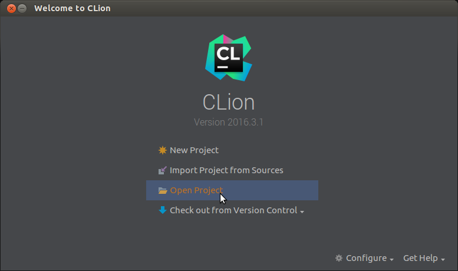

*****************
Configure a build
*****************

After getting the source a build-configuration has to be generated with cmake
for every toolchain and build-type (Debug, Release, ...).

Generate configs using the commandline
======================================

Generate configs using CLion
============================

    Select ``Open Project`` and choose the ``application-controller`` source directory. 

.. figure:: images/CLion_MarkProjectRoot.png

    Mark the source-directory as project-root.

    Open the CMake settings.

.. figure:: images/CLion_SettingsBundledCMake.png

    Choose bundled CMake and GDB.

    Specify build configuration type, external build directory, and toolchain file path.
    Click OK to generate build configuration.

.. figure:: images/CLion_ReloadProject.png

    Reload CMake project if files have been changed externally.
