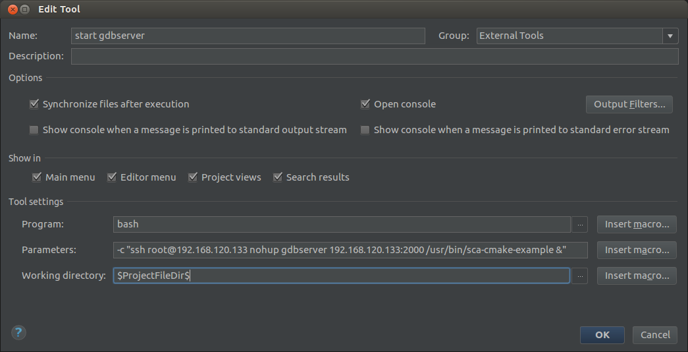

****************************************
Remote Debugging Applications with CLion
****************************************

With a cross-development SDK installed on the development host, it is possible to use CLion to initiate a remote debugging session through the following steps:

.. figure:: images/CLion_RDebug_EditConfig.png

    With the project open, edit the *run configurations*.

.. figure:: images/CLion_RDebug_AddRemoteDebugConfig.png

    Add a GDB remote debug configuration.

.. figure:: images/CLion_RDebug_RemoteDebugConfigValues.png

    From the SDK install path, add the debugger compiled for host as ``GDB``. Add protocol, IP address of the target and gdbserver port in ``'target remote' args``. Add the local copy of the cross compiled binary as the ``Symbol file``. Add the target component of the SDK's sysroot as ``Sysroot``. Add an external tool to be run before launching a debug session.

    Create a new external tool.

    Set program and parameters to kill all running instances of `gdbserver` on target.

    Create another external tool to start `gdbserver` with the binary deployed on target. The port provided here should be the same port specified in the ``'target remote' args`` in the remote debugging configurations above. This tool should be executed after the previous tool.

.. figure:: images/CLion_RDebug_StartDebugging.png

    Now this configuration can be used to start a remote debugging session on the deployed binary.
