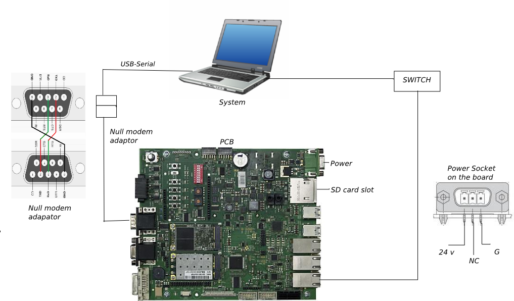

Connecting the application-carrier-board to your development system 
===================================================================

Install required software on your dev-host
==========================================

.. code-block:: console

    $ sudo apt-get install picocom

Booting the board
=================

* After connecting the board run ``picocom`` and power on the board

.. raw:: html

    <tty-player controls poster=npt:28.5 cols=72 rows=30 src="../_static/target_boot.ttyrec"></tty-player>

References
==========

* :download:`ECUcore Overview Manual <./ECUcore_overview_manual.pdf>`
