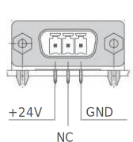
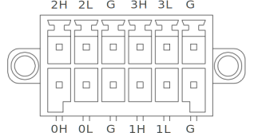
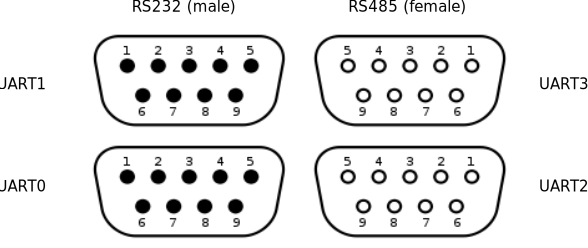

.. _target_wiring_connect:
*************************
Application Carrier Board
*************************

Connecting the application-carrier-board to your development system 
===================================================================

To run and test applications on your target-device it must be accessible from your
development host through ssh and in some cases a serial console would also be required.

.. image:: images/board_conn.svg

Power-Plug
----------

Can-plug
--------

* H:    CAN-High
* L:    CAN-Low
* G:    Ground

Ethernet
--------

.. image:: images/board_eth.svg

Sub-D
-----

Network Connections
-------------------

Make sure your target-board and development host are on the same network and can ping
each other. As a default the target-board uses DHCP to get an IP address.

To verify your connection try to login to the target-board via SSH from your host:

.. code-block:: console

    $ ssh root@TARGET-IP
    
.. note::

    Currently there are only development-images in use which do not have a password set
    for the root-user.

Serial Connections
------------------

Use a USB-Serial-Converter on your development host to connecto to the target-board. Be
aware, that you must use a nullmodem cable to connect the converter to the board.

Install required software on your dev-host
==========================================

.. code-block:: console

    $ sudo apt-get install picocom

Install an image
================

See :ref:`yocto_build_flash_sdcard`.

Booting the board
=================

* After connecting the board run ``picocom`` and power on the board

.. raw:: html

    <tty-player controls poster=npt:28.5 cols=72 rows=30 src="../_static/target_boot.ttyrec"></tty-player>

References
==========

* :download:`ECUcore Overview Manual <./ECUcore_overview_manual.pdf>`
