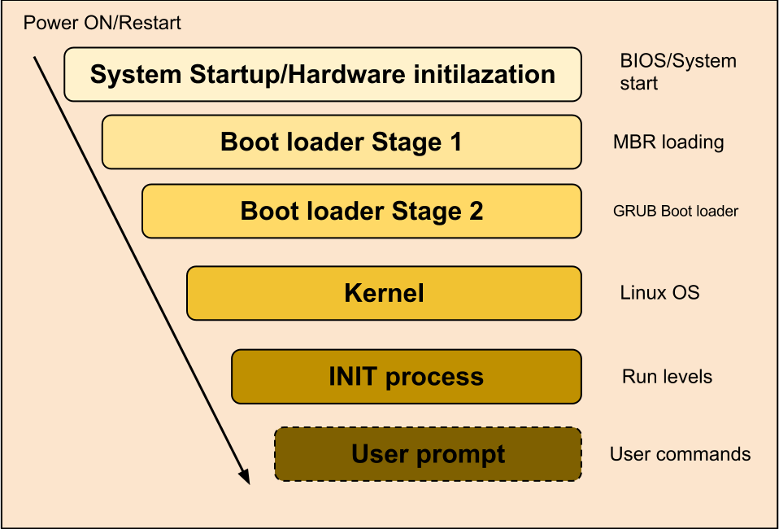

## Bootloader Components
This section describes the components needed to create an basic OS which is delivered in form of an SDCard image, ready to burn on SDCard, plugging this SDCard into the hardware and boot it.
In the following picture the different stages are illustrated.

The Reset Configuration Word (RCW) and the Pre-Boot Initialisation commands (PBI) are loaded at start by the Pre-Boot Loader (PBL) from the SDCard. Principally it is possible that RCW and PBI are loaded from other devices like on-board ROM. But this is already configured on the board and doesnt need to be changed. 
The RCW is 512 bytes long and contains reset configuration information. One information the RCW holds is for example at which address of the same memory device further boot instructions, PBI, are located. These PBI are finally responsible to load the first bootloader stage.

The bootloader may consists of one or more stages. The u-boot used for the ecucore1021-applicationboard uses a 2-staged bootloader consisting of Secondary Program Loader (SPL) and the final bootloader.
The bootloader mainly is responsible for loading the kernel, configuring necessary peripherals like memory and basic communication interfaces (SPI). Therefore the bootloader needs a Device Tree Blob (dtb) which describes that needed peripherals. That is for instance at which address the SPI is working and which controller is working at it.

 
